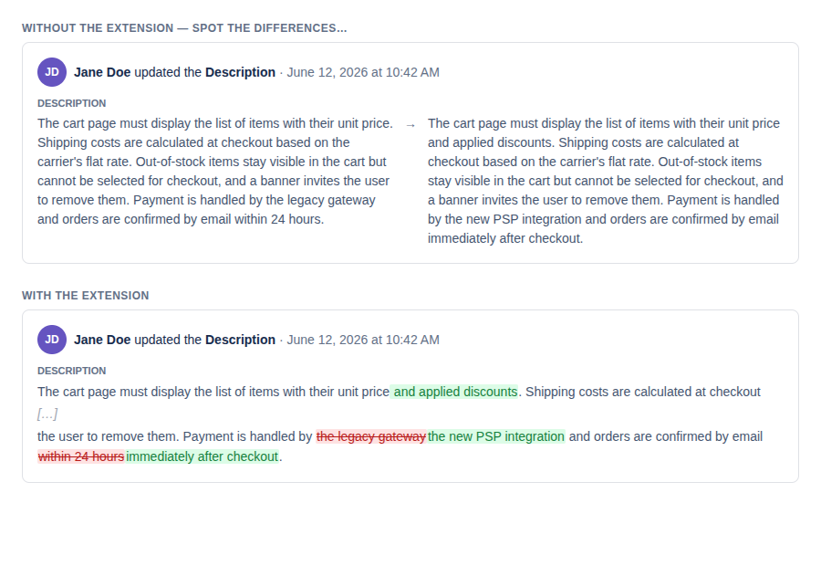

# Jira Description Diff

Chrome extension that highlights word-level changes in Jira's issue description history.

Jira's built-in history only shows the old and new description side by side with no indication of what actually changed. This extension replaces each pair with a single unified diff: added words in green, removed words in red, unchanged text folded away.



*(mock data — regenerate with `docs/mock.html`)*

## Installation

### From source (developer mode)

**Requirements:** Node.js 18+

```bash
git clone git@github.com:Lucas-Malatchoumy/jira-changes-extension.git
cd jira-changes-extension
npm install
npm run build
```

Then load the extension in Chrome:

1. Go to `chrome://extensions`
2. Enable **Developer mode** (toggle, top right)
3. Click **Load unpacked**
4. Select the `jira-changes-extension` folder

The extension is now active on all `*.atlassian.net` pages.

## Usage

Open any Jira issue, scroll to the **Activity** section, and click **History**. Description changes will automatically show highlighted diffs — no button to click, no reload needed.

- Green background = words added in this version
- Red background with strikethrough = words removed in this version
- `[…]` = unchanged text, folded to keep the diff readable (a few context words are kept around each change)

If you navigate between issues, the highlighting re-applies automatically.

## Development

```bash
npm run watch   # rebuilds on every file save
```

After each rebuild, go to `chrome://extensions` and click the refresh icon on the extension card, then reload the Jira page.

## Compatibility

- Jira Cloud (`*.atlassian.net`) only
- Chrome 88+ (Manifest V3)

## How it works

On each issue page, the extension calls Jira's REST API (`/rest/api/3/issue/{key}/changelog`) using your existing session — no API token required. The full changelog is fetched (paginated), so issues with a long history are fully covered.

Each history row is then matched to its API entry by the **(old text, new text) pair** — edits are chained, so matching on either side alone would attribute diffs to the wrong row. The unified diff is rendered in place of the old value and the now-redundant new-value column is hidden. When Jira truncates a long value behind "show more", a prefix-based fallback still matches the row (and skips it rather than guess if two changes share the same prefix).

## Troubleshooting

**Nothing is highlighted after opening History**

Jira occasionally changes the `data-testid` attributes of its history section. Open the browser console on the Jira page and look for `[Jira Diff]` warnings:

- `activity feed not found` → update the `HISTORY_ROOT_SELECTORS` list in `src/content.ts`
- `N/M change(s) not matched in the DOM` → update the `HISTORY_ITEM_SELECTORS` list, or the history simply isn't fully rendered yet (scroll down)

To list the current testids, run in the console:

```js
[...new Set([...document.querySelectorAll('[data-testid*="activity" i],[data-testid*="history" i]')].map(e => e.getAttribute('data-testid')))]
```

Then rebuild (`npm run build`) and reload the extension.
